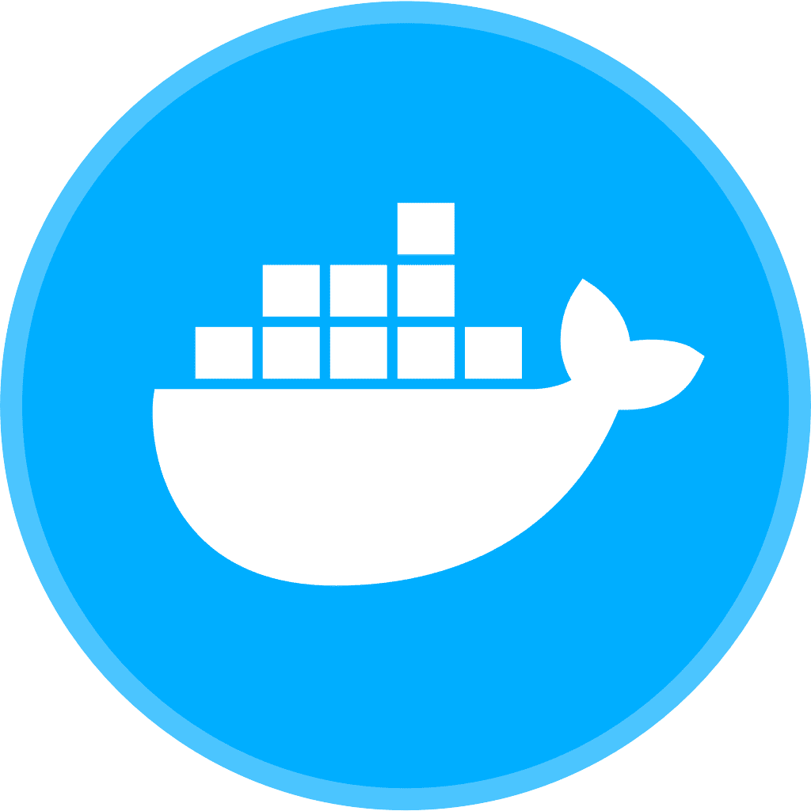

  
  
  

# 👋 ¡Hola! Soy Hans Garcia

### Desarrollador Full Stack, UX/UI Designer y QA Tester

---

## 👨‍💻 Sobre mí

**¡Bienvenido a mi Portafolio!**

Soy un **profesional híbrido** con experiencia en el desarrollo completo de aplicaciones. Mi expertise se centra en el **PERN Stack (PostgreSQL, Express, React, Node)**, con solidez comprobada también en **MERN Stack** y arquitecturas **Blockchain**, con especialización en el ecosistema **Ethereum** (Solidity/EVM).

Mi sólida base como Full Stack me permite enfocarme en un **QA** más profundo, identificando no solo la manifestación del error, sino también la **causa raíz** a nivel de código y arquitectura. Me apasiona construir soluciones robustas, eficientes y con un diseño **UX/UI** funcional.

* 🎯 **Enfoque actual:** Profundizando en la arquitectura **PERN**, desarrollo de **Smart Contracts en Ethereum** y QA Automation.
* 🚀 **Objetivo:** Continuar construyendo soluciones end-to-end con alta calidad y eficiencia.

---

## 🛠️ Mi Stack & Expertise

Aquí se muestran las tecnologías con las que trabajo, organizadas por dominio.

### Front-end, Back-end & Mobile
* **Lenguajes:** JavaScript, TypeScript, Solidity
* **Frameworks/Libs:** React, React Native, Redux, Express.js, Node.js, Babel
* **Estilo/Diseño:** CSS3, SASS, Bootstrap, UX/UI Design

### Calidad & Testing (QA)
| Área | Herramientas / Prácticas |
| :--- | :--- |
| **Gestión** | Jira (Defectos), Zephyr Scale (Casos), Trello |
| **Testing Manual** | Pruebas Funcionales, No Funcionales, Testing de APIs (Postman) |
| **Metodología** | Scrum (Metodología Ágil), Desglose Ágil de Requerimientos (Storytelling) |

---

## 🏗️ Experiencia en Arquitectura y Colaboración

Mi portafolio demuestra experiencia práctica en procesos, más allá del código:

* **Arquitecturas Modernas:** Implementación de sistemas de **Microservicios** y despliegue utilizando **Docker** para asegurar la portabilidad y escalabilidad.
* **Desarrollo Colaborativo:** Dominio de metodologías **Scrum** y *workflow* avanzado de **Git** en la creación de proyectos complejos en equipo (ej. E-commerce).
* **Desarrollo Descentralizado (Web3):** Construcción de **DApps** especializadas en el ecosistema **Ethereum**, incluyendo lógica compleja de **Yield Farming (Staking/Recompensas)**.
* **Movilidad:** Desarrollo de aplicaciones nativas con **React Native**.

---

## 📂 Portafolio de Proyectos y Enlaces

| Categoría | Enlace |
| :--- | :--- |
| **Portafolio Web (General)** | [hans-rafael.github.io](https://hans-rafael.github.io/) |
| **Portafolio UX/UI (Diseño)** | [Ver Proyectos en Behance](https://www.behance.net/hans_garcia) |
| **Repositorios GitHub** | [Ver todos mis Proyectos](https://github.com/Hans-Rafael?tab=repositories) |
| **Portafolio QA (Especializado)** | [Ir al Repositorio de Proyectos QA](https://github.com/Hans-Rafael/[TU_REPOSITORIO_QA]) |

 

### 💻 Herramientas y Tecnologías

  
   React
   JavaScript
   TypeScript
   NodeJS
   Express.js
   Babel
  
    

   PostgreSQL
   MySQL
   Git
   Bootstrap
  
    

   Solidity
   HardHat
   Docker
   Postman

---

Construido y testeado con ❤️ por Hans Garcia

---

<h3 align="left">🤝 Apoya mi trabajo:</h3>

  
  &nbsp;&nbsp;&nbsp;
  

  